

  

  

[-0078D6?style=for-the-badge&logo=windows&logoColor=white)](https://github.com/lasdww/VELORA/releases/latest)

  

### 📥 Загрузка и установка

<table>
  <tr>
    <td align="center" width="50%">
      <h3>🚀 Официальный установщик (.EXE)</h3>
      
Автоматическая установка, интеграция в систему, ярлыки и создание драйвера Wintun в один клик

      
        
      Размер: ~160 МБ · Рекомендуется для всех пользователей
    </td>
    <td align="center" width="50%">
      <h3>📦 Портативная версия (.ZIP)</h3>
      
Распакуйте в любую папку или на флешку и запускайте без установки в систему

      
        
      Размер: ~100 МБ · Включает все движки и драйвер Wintun внутри
    </td>
  </tr>
</table>

 

[⚡ О проекте](#-о-проекте) • [💻 Терминал логов](#-живой-терминал-событий) • [🛡️ Возможности](#-ключевые-возможности) • [🎮 Игровой фильтр](#-игровой-фильтр-zapret) • [⌨️ Горячие клавиши](#️-горячие-клавиши) • [⚙️ Архитектура](#-архитектура-и-стек)

---

## ⚡ О проекте

**Velora** — это сетевой клиент нового поколения для Windows, объединяющий современный стек протоколов **VLESS Reality (XTLS Vision)** и передовой инструмент прямого обхода блокировок DPI **Zapret (WinWS)** в едином высокопроизводительном приложении.

Проект создан с упором на максимальную скорость, отсутствие задержек, бескомпромиссную конфиденциальность и визуальное совершенство в тёмном обсидиановом стиле с аппаратными анимациями.

---

## 💻 Живой терминал событий

Встроенный консольный терминал в стиле macOS с live-трансляцией сетевых событий, инициализации ядра Sing-Box, драйвера Wintun и модуля Zapret:

  

---

## 🛡️ Ключевые возможности

### 1. Двойной сетевой движок: VLESS Reality + Fix Internet (Zapret)
* **VLESS Reality & XTLS Vision**:
  * Под капотом используются оптимизированные бинарные ядра **Sing-Box 1.10+** и **Xray-Core**.
  * Поддержка браузерной маскировки **uTLS Fingerprint** (Chrome, Firefox, Safari, Edge) для полного сокрытия VPN-трафика от алгоритмов обнаружения провайдеров.
  * **TCP Мультиплексирование (MUX)** для объединения нескольких сетевых потоков в одно соединение и устранения задержек при сёрфинге.
* **Fix Internet (Zapret DPI Bypass)**:
  * Прямой обход блокировок без VPN-серверов! Доступ к YouTube в 4K 60fps, Discord, Twitch, Rutracker и другим ресурсам на полной скорости вашего домашнего тарифа.
  * **20 предустановленных стратегий** обхода (general, discord, alternate TCP/UDP, fake TLS ClientHello, fragmentation).
  * Встроенный каталог из **70+ популярных сервисов** с категоризацией, поиском и возможностью мгновенно добавить свои домены.

### 2. Игровой фильтр (Game UDP Filter)
* Интегрированная кнопка «Игровой фильтр» с аппаратным переключателем.
* Автоматически исключает UDP-трафик игр и голосовых чатов (порты `1024-65535`) из обработки DPI-фильтром, сохраняя минимальный пинг и исключая потери пакетов в онлайн-играх (CS2, Dota 2, Valorant, Apex Legends) и Discord Voice.

### 3. Сетевой адаптер Wintun и умная маршрутизация
* **Wintun TUN Adapter**:
  * Полноценный виртуальный сетевой интерфейс уровня ядра Windows.
  * Трафик всех приложений, игр, торрент-клиентов и системных служб направляется через туннель без необходимости настраивать системный прокси.
* **Раздельное туннелирование (Split Tunneling)**:
  * **[Весь трафик]** — глобальное туннелирование.
  * **[В обход сайтов РФ]** — российские сервисы (Яндекс, Госуслуги, VK, банки, онлайн-кинотеатры) идут напрямую на гигабитной скорости, а заблокированные зарубежные ресурсы — через VPN.
  * **[Только заблокированные]** — туннелирование только ресурсов из списка блокировок.
* **Автоматический откат (Fallback)**:
  * Если пользователь отклонил UAC или недоступен драйвер Wintun, клиент мягко переключается на локальный системный прокси без разрыва связи.

### 4. Комплексная защита от утечек
* **Аварийная блокировка (Kill Switch / Strict Route)**: блокирует любой сетевой трафик в случае непредвиденного падения туннеля, гарантируя нераскрытие реального IP.
* **DNS Leak Protection**: принудительный перехват всех системных DNS-запросов (DoH Hijack) и отправка через шифрованные DNS-резолверы Cloudflare / Google.
* **Блокировка IPv6**: изоляция IPv6 для предотвращения просачивания локального адреса провайдера.
* **Раздача в локальную сеть (LAN Share)**: возможность слушать входящие подключения на `0.0.0.0`, позволяя подключать Smart TV, консоли (PlayStation/Xbox) и смартфоны через общий шлюз на ПК.

### 5. Обсидиановый UI и аппаратные анимации
* **Дизайн уровня macOS/iOS**: интерфейс построен на базе WPF .NET 10 с глубокой графитовой подложкой (`#0A0A10`), плавающими полупрозрачными плашками и микротенями.
* **Физические переключатели ModernToggleSwitch**: плавное скольжение тумблеров по траектории с физической кривой `CubicEase` (180 мс) и динамической подсветкой.
* **8 неоновых палитр**:
  * 🌿 Мята (`#65E5BF`)
  * 🪸 Коралл (`#F43F5E`)
  * 🌊 Циан (`#06B6D4`)
  * 🔮 Фиолет (`#8B5CF6`)
  * 🔥 Огонь (`#F97316`)
  * 🍯 Янтарь (`#F59E0B`)
  * 🍋 Лайм (`#84CC16`)
  * ⚙️ Титан (`#94A3B8`)
* **Консольный терминал логов**: терминал в стиле macOS с цветными точками управления, меткой `tunnel.log`, автоскроллом и живой трансляцией логов ядер Sing-Box, Xray и службы Zapret.

### 6. Безопасность на уровне ОС
* Профили серверов, приватные VLESS-ключи и подписки шифруются локально с помощью **Windows DPAPI** (`ProtectedData.Protect`). Ключ расшифровки хранится в защищённом крипто-контексте вашей учетной записи Windows.
* Никаких сторонних баз данных, облачных телеметрий или следящих маяков.

---

## 🚀 Инструкция по использованию

1. **Скачайте установщик** (`VeloraSetup.exe`) или **портативный архив** (`Velora-win-x64.zip`) из блока [Загрузка](#-загрузка-и-установка).
2. **Запустите Velora от имени администратора**:
   > [!IMPORTANT]
   > Права администратора требуются для создания драйвера виртуального сетевого адаптера `Wintun` и перехвата сетевых пакетов драйвером `WinDivert` (Zapret).
3. **Добавьте сервер**:
   * Нажмите `Ctrl + V` для мгновенной вставки VLESS-ключа или ссылки на подписку из буфера обмена.
   * Либо перейдите во вкладку **«Обход блокировок» (Zapret)** и включите тумблер **«Fix Internet»** для ускорения YouTube и Discord без сторонних серверов.
4. **Подключитесь**:
   * Нажмите большую светящуюся кнопку **«Подключить»**.
   * Состояние туннеля и живая диагностика будут отображаться в терминале логов внизу.

---

## ⌨️ Горячие клавиши

| Сочетание клавиш | Действие |
| :--- | :--- |
| <kbd>Ctrl</kbd> + <kbd>V</kbd> | Быстрый импорт сервера или подписки из буфера обмена |
| <kbd>Ctrl</kbd> + <kbd>R</kbd> | Обновить подписки и перезапустить замер пинга серверов |
| <kbd>Ctrl</kbd> + <kbd>Shift</kbd> + <kbd>T</kbd> | Мгновенное переключение режима: `TUN (Полный VPN)` ⇄ `Системный прокси` |
| <kbd>Ctrl</kbd> + <kbd>L</kbd> | Быстрый переход к терминалу логов `tunnel.log` |
| <kbd>Esc</kbd> | Свернуть окно приложения в системный трей Windows |

---

## ⚙️ Архитектура и стек

| Компонент | Назначение |
| :--- | :--- |
| **WPF / XAML (.NET 10)** | Современный UI с аппаратным рендерингом DirectX и плавной частотой кадров |
| **Sing-Box 1.10+** | Скоростной TUN-роутинг, DNS-резолвер и реализация Reality |
| **Xray-Core** | Надежный fallback-движок для протокола VLESS с XTLS Vision |
| **Zapret WinWS** | Модуль обхода ТСПУ/DPI методом модификации TCP/UDP заголовков |
| **WinDivert 2.2** | Низкоуровневый захват сетевых пакетов на уровне ядра Windows |
| **Windows DPAPI** | Аппаратная защита персональных ключей и параметров серверов |

---

## 💻 Системные требования

* **Операционная система**: Windows 10 (версия 1809 и новее) или Windows 11 (64-bit / x64).
* **Права доступа**: Права локального администратора (для создания адаптера Wintun и запуска службы перехвата пакетов WinDivert).

---

## 📜 Лицензия и благодарности

Проект Velora распространяется под лицензией [MIT](LICENSE).

В проекте используются замечательные решения с открытым исходным кодом:
* [Sing-Box](https://github.com/SagerNet/sing-box) — универсальная прокси-платформа (GPL-3.0)
* [Xray-core](https://github.com/XTLS/Xray-core) — современный сетевой движок (MPL-2.0)
* [Zapret](https://github.com/bol-van/zapret) — автономный инструмент обхода DPI (MIT)
* [WinDivert](https://github.com/basil00/Divert) — драйвер захвата пакетов Windows (LGPL-3.0 / GPL-2.0)
* [Wintun](https://www.wintun.net/) — сверхбыстрый TUN-драйвер от создателей WireGuard (MIT)

 
<b>Сделано с ❤️ для свободного, быстрого и безопасного интернета</b>

